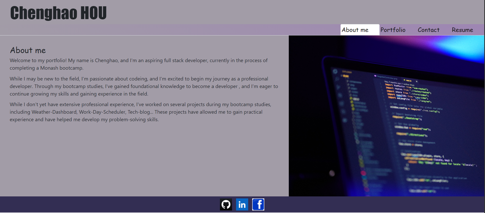
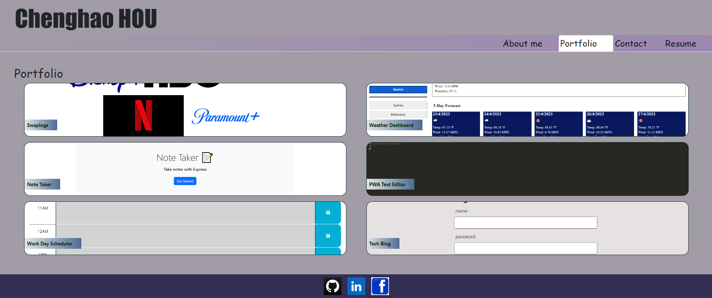

# React-Protfolio

## Description
This is my persnal porfolio which features some of my github projects and my resume and techinical skills.

## Installation
1. Installation: npm install
2. in project run: npm run start and open http://localhost:3000 to view it in the browser.

## Mockup

## Link
Github: https://github.com/houchenghao/React-Protfolio
Application: https://houchenghao.github.io/React-Protfolio